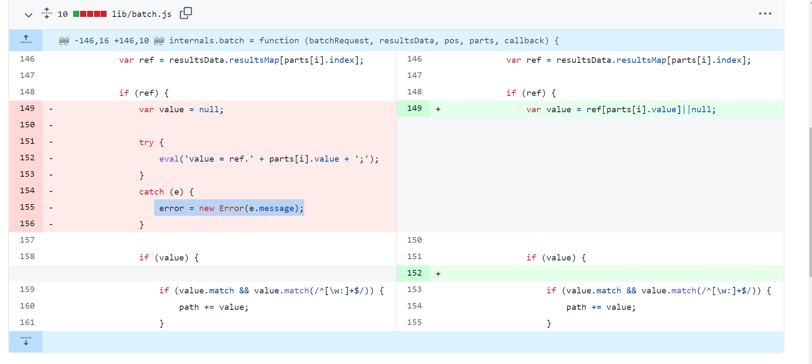

### bassmaster
- Instalar nodeJS version8
[https://joshtronic.com/2018/05/07/how-to-install-the-latest-version-of-nodejs-8-on-ubuntu-1804-lts/](https://joshtronic.com/2018/05/07/how-to-install-the-latest-version-of-nodejs-8-on-ubuntu-1804-lts/)
- Python2.7
- Ubuntu 14.04
- npm install // package-json
- Editar `./bassmaster/examples/batch.js`
```node
[...]
    { method: 'GET', path: '/request', handler: internals.requestBatch }
]);

internals.http.register(require('bassmaster'), function (err) {

    if (err) {

[...]
```
- Finalmente: `node batch.js`

- El servidor correrá de manera correcta pero no se establece la funcion `eval`
Por tanto tendremos que configurarlo manera manual [https://github.com/outmoded/bassmaster/commit/b751602d8cb7194ee62a61e085069679525138c4](https://github.com/outmoded/bassmaster/commit/b751602d8cb7194ee62a61e085069679525138c4)



-----

#### Hapi
Crear aplicaciones y servicios enfocándonos en escribir lógica de aplicación reusable en vez de invertir tiempo en construir infraestructura

#### Bassmaster
Bassmaster facilita la combinación de solicitudes en una sola. También es compatible con la canalización, lo que le permite tomar el resultado de una consulta en la solicitud por lotes y usarlo en una posterior. El extremo del lote solo responde a las solicitudes POST.

-----

#### Descubrimiento de vulnerabilidad
```bash
grep -rnw "eval(" . --color
```
